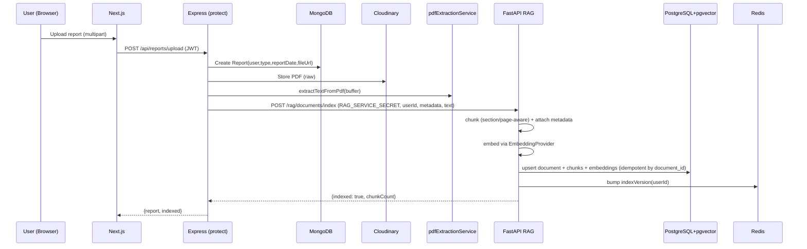
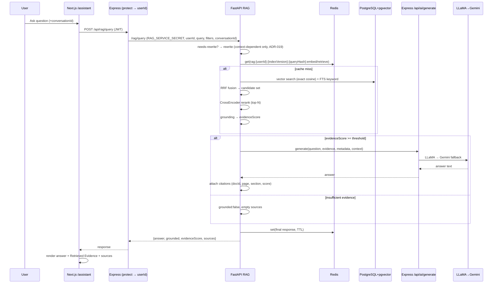
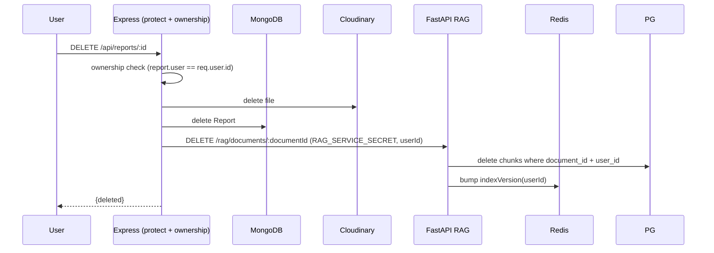

# Data Flow

> Fact/Decision/Assumption/Experiment/Result/Future option labels apply.

## 1. Upload & Indexing Flow

Notes:
- Extraction is **Express-side** in V1 (ADR-014). Text (not raw PDF) crosses to FastAPI.
- Indexing is **synchronous** in V1 (ADR-015).
- Idempotent by `document_id` → re-uploads replace chunks.

## 2. Query Flow

## 3. Delete Flow

Security: deletion is owner-scoped in Express **and** FastAPI enforces `user_id` on the delete (ADR-012).

## 4. Re-index Flow (backfill / edit)

- Trigger: backfill script, or report edit/metadata change.
- Steps: fetch source PDF from Cloudinary → extract (Express) or (future) FastAPI → chunk → embed → **replace** old chunks for `document_id` (idempotent) → bump `indexVersion`.

## 5. Evaluation Flow

- Load synthetic de-identified dataset (`evaluation/dataset.json`).
- For each strategy (vector-only / hybrid / hybrid+rerank): run retrieval, compute Recall@K/MRR/Precision@K; run generation, compute faithfulness/answer relevance.
- Emit reproducible report (JSON + markdown) with **measured** numbers only.

## 6. Pending / Future

- Async ingestion worker (ADR-015) and FastAPI-side extraction (ADR-014) are **future options**, not current flows.
